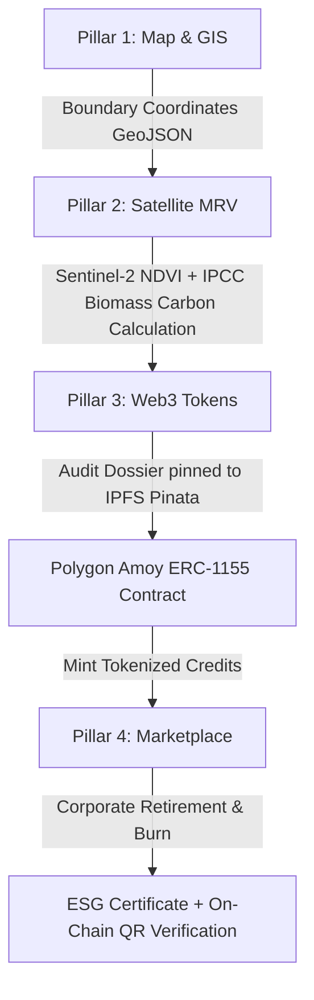

# 🌊 AegisBlue — Technology Stack & Architecture Specification
> **Platform:** AegisBlue • Decentralized Blue Carbon MRV & Tokenization Engine  
> **Repository:** `rujopujo/aegisblue`  

---

## 🏛️ System Architecture Overview

---

## 1. Programming & Scripting Languages

| Language | Version / Specification | Scope & Usage in AegisBlue |
| :--- | :--- | :--- |
| **TypeScript** | `v5.6` | Type-safe frontend application, Leaflet map logic, API client, Web3 contract interfaces, and data models |
| **Python** | `v3.12 / 3.13` | Backend geospatial MRV microservice, satellite STAC querying, allometric biomass algorithms, IPFS pinning, and SQLite engine |
| **Solidity** | `v0.8.24` *(Cancun EVM)* | Smart contract logic implementing the ERC-1155 decentralized Blue Carbon standard (`contracts/AegisBlueCarbonCredit.sol`) |
| **JavaScript / CommonJS** | Node.js (ESM & CJS) | Hardhat configuration, Web3 deployment automation scripts, verification tasks, and PostCSS/Tailwind configuration |
| **SQL** | ANSI SQL / SQLite Dialect | Relational schema definitions and queries for project tokens and retirement records |
| **HTML5 & CSS3** | Modern Standards | Semantic document structure and custom responsive styling |

---

## 2. Frontend Framework & UI Libraries

| Technology | Package | Purpose |
| :--- | :--- | :--- |
| **React 18** | `react`, `react-dom` | Component-based reactive UI architecture |
| **Vite 6** | `vite`, `@vitejs/plugin-react` | Build engine, local HMR development server, and backend dev reverse proxy |
| **Tailwind CSS** | `tailwindcss`, `postcss`, `autoprefixer` | Utility-first styling engine tailored with a custom oceanic dark-mode palette |
| **Lucide Icons** | `lucide-react` | Clean iconography for MRV pipelines, sensor status, and metrics |
| **Class Utilities** | `clsx`, `tailwind-merge` | Conditional class composition and utility conflict resolution |
| **Micro-Interactions** | `canvas-confetti` | Particle animations celebrating tokenization and credit retirements |

---

## 3. Geospatial & Mapping (GIS)

| Technology | Source / Package | Function |
| :--- | :--- | :--- |
| **Leaflet & React-Leaflet** | `leaflet`, `react-leaflet` | Interactive map interface supporting satellite, oceanographic, and street map layers |
| **Custom Polygon Drawing Tools** | Custom Leaflet Vector Handlers | Interactive polygon drawing for NGOs to demarcate coastal mangrove project parcels |
| **Shapely** | `shapely` (Python 2.x) | 2D computational geometry: boundary validation, self-intersection checks, and area calculations |
| **Global Mangrove Watch (GMW v3.0)** | GIS Vector Dataset | Ground-truth reference layer validating whether drawn boundaries fall inside designated mangrove biomes |
| **Smithsonian Coastal Carbon Network (CCN)** | Soil Core GIS Dataset | Soil core data integration providing real-world ground-truth carbon density per coordinate |
| **STAC (SpatioTemporal Asset Catalog)** | Element84 / Earth Search | Querying multispectral satellite scenes based on polygon bounding boxes |

---

## 4. Satellite MRV & Carbon Science

| Scientific Method / Tool | Technology | Description |
| :--- | :--- | :--- |
| **Sentinel-2 Multispectral Telemetry** | ESA / Copernicus L2A Imagery | Optical band extraction: Band 4 (Red) & Band 8 (Near-Infrared / NIR) |
| **NDVI Calculation** | Mathematical Algorithms | $(NIR - RED) / (NIR + RED)$ to quantify canopy chlorophyll density and health |
| **IPCC Tier-3 Wetland Supplement (2013)** | Allometric Modeling Equations | Translates NDVI + area into Above-Ground Biomass (AGB), Below-Ground Biomass (BGB), and Soil Organic Carbon (SOC down to 1m) |
| **NumPy** | `numpy` | High-performance numerical matrix array operations for carbon tonnage estimates |

---

## 5. Backend Microservice & Database

| Technology | Package | Purpose |
| :--- | :--- | :--- |
| **FastAPI** | `fastapi` | Asynchronous Python REST API framework for MRV validation, IPFS, and retirements |
| **Uvicorn** | `uvicorn` | High-performance ASGI web server |
| **Pydantic** | `pydantic` (v2.x) | Strict request/response payload parsing and schema validation |
| **SQLAlchemy** | `sqlalchemy` (v2.x) | Python SQL toolkit and ORM connecting to the project database |
| **SQLite** | `sqlite3` (`aegisblue.db`) | Self-contained relational database storing verified projects and retirement ledgers |
| **HTTP Clients** | `httpx`, `requests` | Async & sync HTTP communication with Pinata and STAC satellite endpoints |

---

## 6. Web3, Blockchain & Decentralized Storage

| Technology | Details | Application |
| :--- | :--- | :--- |
| **Polygon Amoy Testnet** | Chain ID: `80002` | Low-gas, EVM-compatible PoS Layer-2 blockchain for carbon credit lifecycle |
| **OpenZeppelin Contracts** | `@openzeppelin/contracts` (v5.6) | Secure standard implementations (`ERC1155`, `Ownable`) |
| **Ethers.js** | `ethers` (v6.17) | Web3 client library to connect MetaMask, sign transactions, and interact with smart contracts |
| **Hardhat** | `hardhat`, `@nomicfoundation/hardhat-toolbox` | Ethereum development environment: compilation, deployment scripts, gas reports, and test execution |
| **Pinata IPFS API** | REST API / Pinata Cloud | Decentralized, immutable pinning of MRV audit dossiers, satellite telemetry, and polygon GeoJSON |

---

## 7. ESG Certificate Engine & Public Verification

| Tool | Package | Function |
| :--- | :--- | :--- |
| **jsPDF** | `jspdf` | Client-side generation of corporate ESG Carbon Retirement Certificates |
| **QR Code Engine** | `qrcode`, `@types/qrcode` | Generates on-chain verification QR codes embedded in certificates |
| **Public Verification Portal** | `src/components/VerificationPage.tsx` | Live public portal where anyone can scan the QR code to verify on-chain burn transactions |

---

## 8. Testing & Quality Assurance

| Test Runner | Scope | Coverage |
| :--- | :--- | :--- |
| **Pytest** (`pytest`) | Python Backend Tests | **33 passing tests** covering IPFS pinning, credit retirements, and cryptographic verification |
| **Hardhat / Mocha / Chai** | Smart Contract Tests | **34 passing tests** covering ERC-1155 minting, retirement/burn mechanisms, access control, and event emission |
| **TypeScript Compiler** (`tsc`) | Frontend Codebase | Static type-checking across all components, API models, and Web3 interfaces |

---

## 9. DevOps, Containers & Infrastructure

| Tool | Purpose |
| :--- | :--- |
| **Docker** | Containerization of frontend and backend microservices |
| **Docker Compose** | Multi-container orchestration (`docker-compose.yml`) |
| **Nginx** | Production reverse proxy, static file server, and gzip compression |
| **Git & GitHub** | Collaborative version control with feature branches and PR workflows |
| **Dotenv** | Secure environment variables management (`.env`, `.env.example`) |
